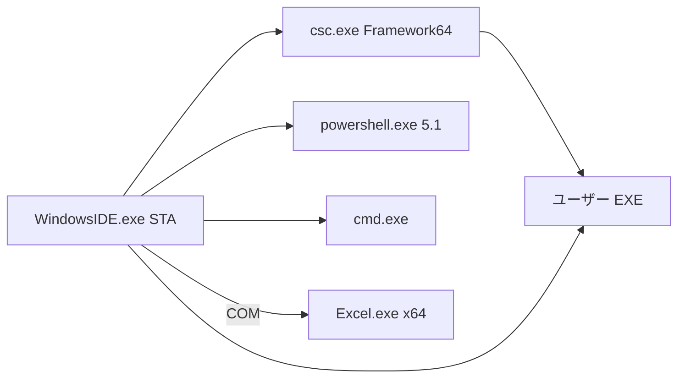

# 構成

## リポジトリ（開発）と製品の境界

```text
WindowsIDE/                     この git リポジトリ（Cursor で編集）
  docs/                         仕様（正）
  .cursor/                      MCP と rules。製品に含めない
  scripts/                      Cursor 用 Python（MCP 起動と凍結検査）。製品に含めない
  src/WindowsIDE/               製品 C# 5 ソース（実装時）
  build/                        compile.ps1 と csc レスポンスファイル（実装時）
  tests/                        オフライン検証（実装時）
```

製品の配布物は `build/out/WindowsIDE.exe` と、必要なら隣の PDB だけ。Python も Node も同梱しない。

## 実行時プロセス



- UI は WinForms。メインは STA（Excel COM のため `[STAThread]`）。
- ユーザー C# プログラムは別プロセス。IDE を落とさない。
- PowerShell は可能なら同一プロセスの Runspace（`System.Management.Automation`）。対話ターミナルは `powershell.exe` をリダイレクトしてもよい。
- VBA の実行主体は Excel。IDE は同期と `Application.Run`、エラー表示を担う。

## 製品内部（単一 EXE）

名前空間の目安。フォルダも同じ分割にする。

| 名前空間 | 責務 |
| --- | --- |
| `WindowsIDE` | `Program.Main`、起動引数（`StartupArgs`）、未処理例外 |
| `WindowsIDE.Ui` | メイン枠、テーマ、コマンドパレット |
| `WindowsIDE.Ui.Fonts` | 埋め込みフォントのプロセス内登録 |
| `WindowsIDE.Editor` | バッファ、キャレット、描画、選択、Undo |
| `WindowsIDE.Workspace` | フォルダ、ツリー、設定 XML |
| `WindowsIDE.Languages` | 言語判定（`LanguageDetector`）、字句解析（`ILineLexer` / 各レキサ）、行開始状態（`HighlightSession`）、キーワード |
| `WindowsIDE.Build` | `csc` 引数、診断パース |
| `WindowsIDE.Debug` | セッション、ブレーク、出力 |
| `WindowsIDE.Host.PowerShell` | 実行と PS デバッガ |
| `WindowsIDE.Host.Cmd` | cmd / bat |
| `WindowsIDE.Host.Csharp` | コンパイルして起動、のち CLR デバッグ |
| `WindowsIDE.Vba` | ディスク木、マップ、Excel 同期 |
| `WindowsIDE.Terminal` | 統合ターミナル |

編集器は `RichTextBox` に色を載せる方式にしない（遅い、フォント混在が苦しい）。`Control` を継承し、GDI+ で行単位描画する。

## ワークスペース配置（ユーザー側）

```text
MyProject/
  .windows-ide/
    workspace.xml
    vba-map.xml
  src/
    Program.cs
  vba/
    Lib/
      StringUtil.bas
    App/
      Main.bas
  scripts/
    run.ps1
    clean.cmd
```

`.windows-ide/` が無いフォルダも開ける。初回保存や VBA 同期時に作ってよい。

## セキュリティ境界

- ユーザーコードの実行は明示操作（実行 / デバッグ）のときだけ。
- Excel マクロ実行も明示。自動で全モジュールを走らせない。
- ワークスペース外への書き込みは、名前を付けて保存などユーザー操作に限る。
