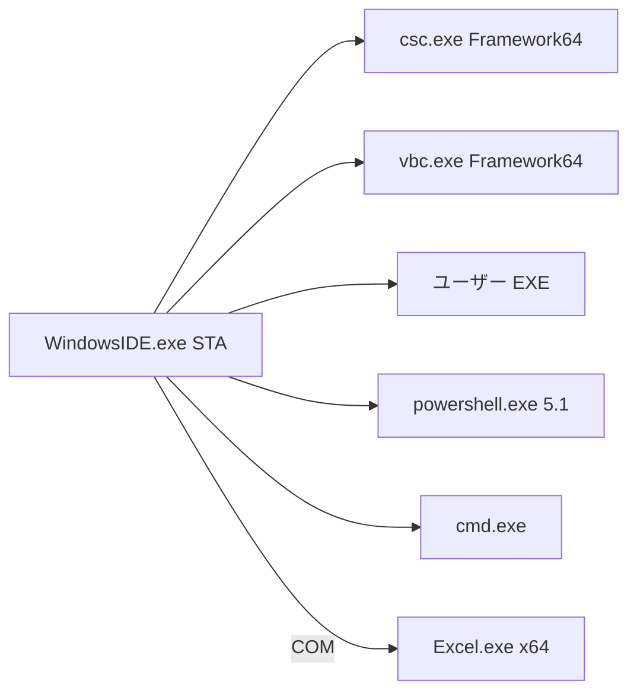

# 構成

## リポジトリ（開発）と製品の境界

```text
WindowsIDE/                     この git リポジトリ（Cursor で編集）
  docs/                         仕様（正）
  .cursor/                      MCP と rules。製品に含めない
  scripts/                      Cursor 用 Python（MCP 起動と凍結検査）。製品に含めない
  src/WindowsIDE/               製品 C# 5 ソース（実装時）
  build/                        compile.ps1 と csc レスポンスファイル（実装時）
  tests/                        オフライン検証（実装時）
```

製品の配布物は `build/out/WindowsIDE.exe` と、必要なら隣の PDB だけ。Python も Node も同梱しない。

## 実行時プロセス



図の `ui --> child` は手動ビルド成功後の `WindowsIDE.Host.Csharp`（およびフェーズ P9 の `WindowsIDE.Host.VbNet`）起動。csc / vbc は起動しない。常時コンパイルの一時生成物は起動しない。`vbc.exe` 経路はフェーズ P9（今は実装しない）。

- UI は WinForms。メインは STA（Excel COM のため `[STAThread]`）。
- ユーザー C# プログラムは別プロセス。IDE を落とさない。手動ビルド成功後の起動だけが `WindowsIDE.Host.Csharp`（csc は持たない）。常時コンパイル（F-LIVE）の一時生成物は起動しない。
- ユーザー VB.NET（フェーズ P9。今は実装しない）は指定 `vbc.exe` でビルドし、成功後の EXE 起動は `WindowsIDE.Host.VbNet`（vbc は持たない。名前は `Host.VisualBasic` にしない。VBA と衝突する）。Excel は起動しない。csc に `.vb` を渡さない。vbc に `.cs` を渡さない。
- P1 のユーザー `.ps1`（F-PS-RUN）は `powershell.exe` 5.1 の子プロセス（`WindowsIDE.Host.PowerShell`）。同一プロセスの Runspace は P3 F-DBG-PS の余地として残し、波線のために Runspace を増やさない。対話ターミナル（F-TERM）は `WindowsIDE.Terminal` の ConPTY であり、この 1 ショットホストとは別プロセスとして共存できる。PS 構文エラー位置は `WindowsIDE.Languages` が `ParseInput` する（実行しない）。
- P1 のユーザー `.cmd` / `.bat`（F-CMD-RUN ファイル実行と選択行）は `cmd.exe` の子プロセス（`WindowsIDE.Host.Cmd`）。選択行は所有 TEMP の `.cmd` を書いて同じ起動経路へ渡す。対話ターミナル（F-TERM）は `WindowsIDE.Terminal` の ConPTY。C# / PowerShell / cmd の 3 つの 1 ショットホストは同時に走らせない（P9 で VB.NET EXE を足したら 4 つ排他）。PTY は 1 ショットと共存し、1 ショットの Kill 集合には入らない。
- VBA の実行主体は Excel。IDE は同期と明示の `Application.Run`、エラー表示を担う。フェーズ P7 で診断専用の Excel Compile を足す（Run はしない。`WindowsIDE.Vba`）。`.vb` は VBA 同期の対象外である。

## 製品内部（単一 EXE）

名前空間の目安。フォルダも同じ分割にする。

| 名前空間 | 責務 |
| --- | --- |
| `WindowsIDE` | `Program.Main`、起動引数（`StartupArgs`）、未処理例外 |
| `WindowsIDE.Ui` | メイン枠、テーマ、FindBar、HoverInfoControl（F-HOV。既存色。`SW_SHOWNOACTIVATE` / `WS_EX_NOACTIVATE`。折返しと ThemedScrollBar）、ChromeMark（FindBar のみ）、CreateBarGlyph、FileTreeCreateBar、DualFontField（FindBar とツリー作成／リネーム）、BottomPane（問題 / 出力 / ターミナル）、ProblemListControl、OutputPanelControl、TerminalControl。将来: コマンドパレット、Markdown プレビュー枠、VBA 参照 UI（フェーズ P8） |
| `WindowsIDE.Ui.Fonts` | 埋め込みフォントのプロセス内登録 |
| `WindowsIDE.Editor` | バッファ、キャレット、描画、選択、Undo、IndentRules（言語非依存 F-IND）、FindRules（言語非依存 F-FIND）、対括弧の FillRectangle（F-BR。Selection / Error）、自動閉じと F-SIND / VBA 終端の挿入、F-DOC の挿入、ホバー枠のホスト、Document.Retarget（ディスク移動後のパス追従。本文は書かない）。将来: インデント線（F-IG。LineNumber。TextBodyClip 内。今は実装しない）、波線描画、キー記録（P7-C・P8。今は実装しない） |
| `WindowsIDE.Workspace` | フォルダ、ツリー、設定 XML、WorkspaceItemRules（名前検証・リネームパス・ディレクトリ境界）、WorkspaceCreateRules（新規作成。検証は ItemRules へ委譲）、WorkspaceRecycle（shell32 SHFileOperation ごみ箱。追加 /r なし） |
| `WindowsIDE.Languages` | 言語判定（`LanguageDetector`）、字句解析（`ILineLexer` / 各レキサ）、識別子分類（`IdentifierClassifier`）、C# 束縛（`CSharpSemantic` / `BclTypeCache` / ワークスペース型名。宣言は `CSharpSemantic.Collect`）、行開始状態と識別子オーバーレイ（`HighlightSession`）、キーワード、対括弧照合（`BraceMatch`）、自動閉じ規則（`AutoCloseRules`）、F-SIND デルタ（`SmartIndentRules`）、VBA ブロック終端（`VbaBlockRules`）、F-VBA-CASE（`VbaKeywordCase`）、位置付きシンボル（`DeclaredSymbol` / `CSharpSymbols` / `WorkspaceSymbols` / `DefinitionResolver`）、F-DOC 規則（`DocCommentRules`）、F-HOV 抽出（`HoverText` / `BclXmlDocs`。シグネチャ常時）。Theme / WinForms は参照しない。将来: `VbNetLexer`（P9。今は実装しない）、波線位置、PS `ParseInput` エラー位置、`MarkdownLexer`（P8。今は実装しない） |
| `WindowsIDE.Build` | 手動 csc（指定 Framework パス、6 DLL、rsp、`CscRunner`、診断パース）。生成 EXE は TEMP に出す。`Process.Start` しない。起動は持たない。VBA Compile は置かない。将来の常時コンパイル（デバウンス、前回 csc の Kill、一時出力）もここ。将来の手動 vbc（`VbcRunner`。F-VB-BLD。P9。今は実装しない）もここ。csc に `.vb` を渡さない |
| `WindowsIDE.Debug` | セッション、ブレーク、出力 |
| `WindowsIDE.Host.PowerShell` | P1 は `powershell.exe` 5.1 子プロセスでユーザー `.ps1` を実行する。同一プロセス Runspace は P3 F-DBG-PS の余地。波線のために Runspace を増やさない。Parse は Languages |
| `WindowsIDE.Host.Cmd` | P1 のユーザー `.cmd` / `.bat`（F-CMD-RUN ファイル実行と選択行）は `System32\cmd.exe` の子プロセス。選択行は所有 TEMP の `.cmd` を書いて同じ起動経路へ渡す。対話は `WindowsIDE.Terminal`（ConPTY）。C# / PowerShell / cmd の 3 つの 1 ショットは同時に走らせない |
| `WindowsIDE.Host.Csharp` | 手動ビルド成功後のユーザー EXE 起動と stdout/stderr。csc は持たない。常時コンパイル（F-LIVE）はここに置かない。のち CLR デバッグ。VBA Compile は置かない。vbc も持たない |
| `WindowsIDE.Host.VbNet` | フェーズ P9。手動 vbc 成功後のユーザー EXE 起動。vbc は持たない。名前は `Host.VisualBasic` にしない。今は実装しない |
| `WindowsIDE.Vba` | ディスク木、マップ、Excel 同期（P2 F-VBA-SYNC 実装済み）。ツリーのディスクリネーム／削除はマップ Ok なら relpath 更新またはエントリ削除（COM 無し。推測紐付けしない）。Compile（F-VBA-BLD）/ References（F-VBA-REF）/ `Application.Run` は将来 |
| `WindowsIDE.Macro` | フェーズ P8。キー記録の再生と、パレットコマンド名を PowerShell 5.1 から呼ぶ薄い面。拡張ホストではない |
| `WindowsIDE.Terminal` | 統合ターミナル（ConPTY）。CreateProcess は EXTENDED_STARTUPINFO_PRESENT。CREATE_NO_WINDOW と STARTF_USESTDHANDLES は付けない。レジストリ Blind Access Off のときだけ張り付き SPI_GETSCREENREADER をライブ解除し、PTY 子へ TERM は渡さない。シェルパス、VT 画面、セッション、入力分類。WinForms / Theme / Host.* は参照しない。1 ショットホストとは共存する |

編集器は `RichTextBox` に色を載せる方式にしない（遅い、フォント混在が苦しい）。`Control` を継承し、GDI+ で行単位描画する。

## 診断の正とコンパイル単位

言語ごとの診断の正:

| 言語 | 正 | 置く名前空間 |
| --- | --- | --- |
| C# | 指定 Framework `csc.exe` のみ | `WindowsIDE.Build`。起動は `Host.Csharp` |
| VB.NET | 指定 Framework `vbc.exe` のみ（フェーズ P9。今は実装しない） | `WindowsIDE.Build`（`VbcRunner`）。起動は `Host.VbNet`。`WindowsIDE.Vba` に置かない |
| VBA | Excel VBA コンパイラ（プッシュ後の Compile。Run しない） | `WindowsIDE.Vba`。Build にも Host.Csharp にも置かない |
| PowerShell | `Parser.ParseInput`（実行しない） | `WindowsIDE.Languages` |
| cmd | 波線なし（W） | |

`CSharpSemantic` など自前パーサの失敗をコンパイラエラーとして問題一覧に出さない。VbaLexer の推測を VBA コンパイラと呼ばない。常時コンパイル（F-LIVE）は `WindowsIDE.Build` が担い、起動は `WindowsIDE.Host.Csharp` ではない。F-LIVE は csc 専用のまま。VB.NET の常時診断は F-VB-LIVE（P9。今は実装しない）であり F-LIVE に足さない。

ユーザー C# の常時コンパイル単位は、採用済み提案 P14 どおりワークスペース内すべての `.cs` を 1 単位とする。複数 `Main` は csc エラー。無題 C# は一時ファイルで含める。フェーズ P7 では csproj を作らない。`.vb` を csc 単位に混ぜない（提案 P28）。

## ワークスペース配置（ユーザー側）

```text
MyProject/
  .windows-ide/
    workspace.xml
    vba-map.xml
  src/
    Program.cs
  vba/
    Lib/
      StringUtil.bas
    App/
      Main.bas
  scripts/
    run.ps1
    clean.cmd
```

`.windows-ide/` が無いフォルダも開ける。初回保存や VBA 同期時に作ってよい。

## ユーザーソースのエンコーディング

| 拡張子 | 既定 |
| --- | --- |
| `.cs` / `.vb` / `.ps1` | UTF-8 BOM（提案 P7。`.vb` はフェーズ P9） |
| `.bas` / `.cls` | 新規は 0 バイト・CP932 BOM なし（P2） |
| `.cmd` / `.bat` | D23（新規・0 バイト Open・無題 SaveAs は CP932 BOM なし CRLF。保存時は BOM を書かない。非空 UTF-8 BOM は Open 検出どおり UTF-8、Save で BOM だけ落とす） |

## セキュリティ境界

- ユーザーコードの実行は明示操作（実行 / デバッグ）のときだけ。常時コンパイルは診断のみであり、実行ではない。
- Excel マクロ実行も明示。自動で全モジュールを走らせない。STA の診断 Compile（F-VBA-BLD）は可。バックグラウンドスレッドでは Compile / Run しない。キー入力ごとの同期 Excel Compile は禁止。
- 任意の COM 参照追加（F-VBA-REF、フェーズ P8）は明示操作だけ。足したコードは Excel プロセスに載る。
- ワークスペース外への書き込みは、名前を付けて保存などユーザー操作に限る。
- 選択行実行が作る所有 TEMP の `.cmd`（`%TEMP%\WindowsIDE\run\cmd\`）は IDE が生成し、終了または起動失敗のあとベストエフォートで消す。ユーザーのソースパスは消さない。
